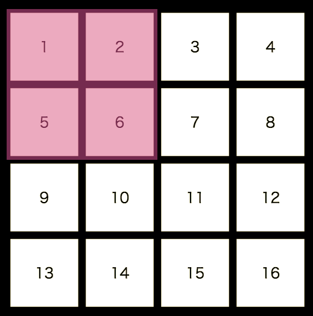

# RotationPuzzle
マス目を回転させ、下のように数字を並べるパズルです。

## 操作方法
spaceキー : 回転させる正方形のサイズを変更できます。2x2 と 3x3 が選択できます。

c : 反時計回りに正方形を回転させます。

v : 時計回りに正方形を回転させます。 

q : 盤面を最初の状態に戻します。

p : 問題を変更します。

## その他
- 稀にBestMoveは最短手数より多いことがあります。

## URL

https://shibungi.github.io/RotationPuzzle/
